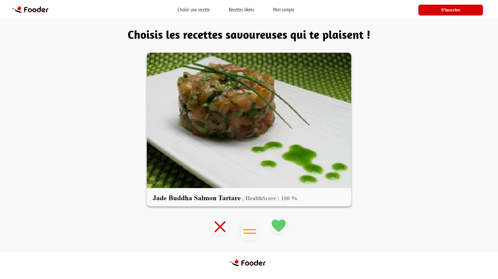

# Fooder - Solution Factory


[](https://opensource.org/licenses/MIT)

Fooder is a Recipe recommendation system.

# Summary
- [Fooder - Solution Factory](#fooder---solution-factory)
- [Summary](#summary)
- [Global description](#global-description)
- [Prerequisite](#prerequisite)
- [Installation](#installation)
        - [Back](#back)
        - [Front](#front)
- [Screenshots](#screenshots)
- [Authors](#authors)
- [LICENSE](#license)

# Global description
Food is a subject at the heart of many issues: 
health, well-being and ecology. Fooder is a solution that suggests healthy, balanced recipes, both good and virtuous. Users can swipe through thousands of recipes with a Tinder like interface and are able to save recipes to their digital cookbook.

This project is part of the end of 3rd year project in Data Science, the Solution Factory 2022.

# Prerequisite
Make sure you have installed all of the following prerequisites on your development machine:

- [Anaconda](https://www.anaconda.com/download/)
- [Python 3.7](https://www.python.org/downloads/)
- [nltk](https://www.nltk.org/install.html) 

    ```
    ntlk.download() #the first time only
    ```
# Installation
1. To install, you first need to clone or download the project.

```bash
git clone https://github.com/TBillaudeau/Solution-Factory
```

2. Install dependencies

```cmd
npm install --global http-server
```

3. Run the website

#### Front
```cmd
cd frontend/
```
```cmd
http-server
```
#### Back
```cmd
cd backend/
```
```cmd
python -m venv venv
```
```cmd
venv\Scripts\activate.bat
```
```cmd
pip install flask flask-cors
```
```cmd
pip install pandas
```
```cmd
python app.py
```

# Screenshots




# Authors
This project have been designed and developped by :
- `Louis Arbey`
- `Thomas Billaudeau`
- `Pierre-Louis Cretinon`
- `Eva Chambaron`
- `Hugo Nahon--Bernical`
- `Marc Bernard`

# LICENSE
[MIT](https://choosealicense.com/licenses/mit/)